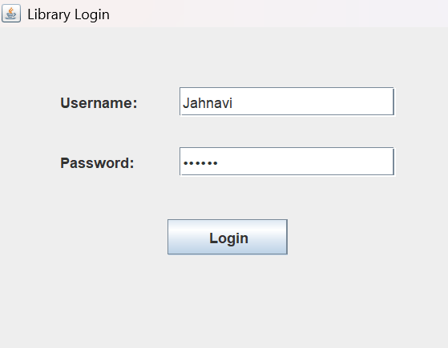
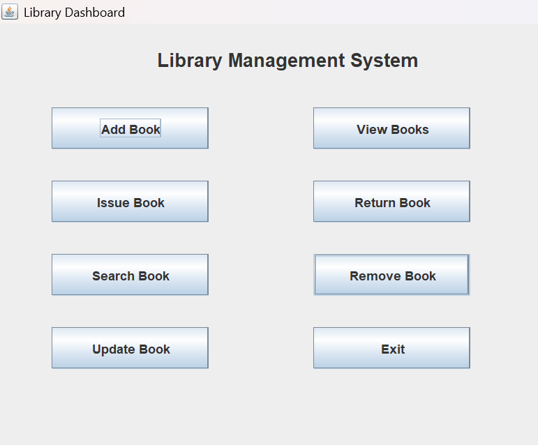
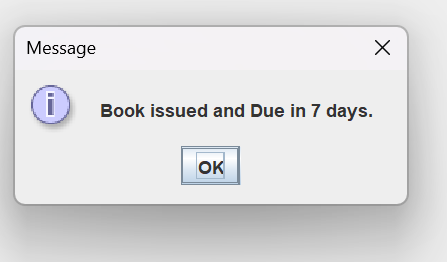
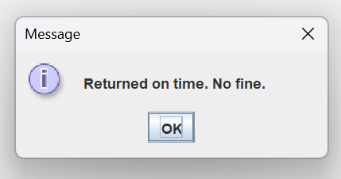
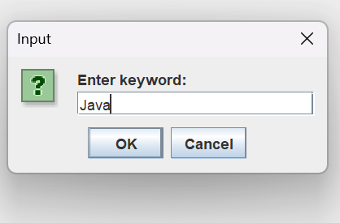
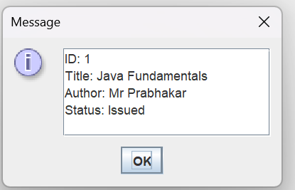

Library Management System:
Description:
Library Management System is a Java-based application developed using Core Java, JDBC, and MySQL with a Swing GUI. 
The system enables efficient management of library operations, allowing the admin to perform CRUD operations on books, issue
and return books, track availability, and calculate fines for late returns.

Technologies Used
Java (Core Java)
JDBC
MySQL
Swing (GUI)

Screenshots
Login Page

Dashboard

View Books

Issue Books

Return Books

Search

Search Result

